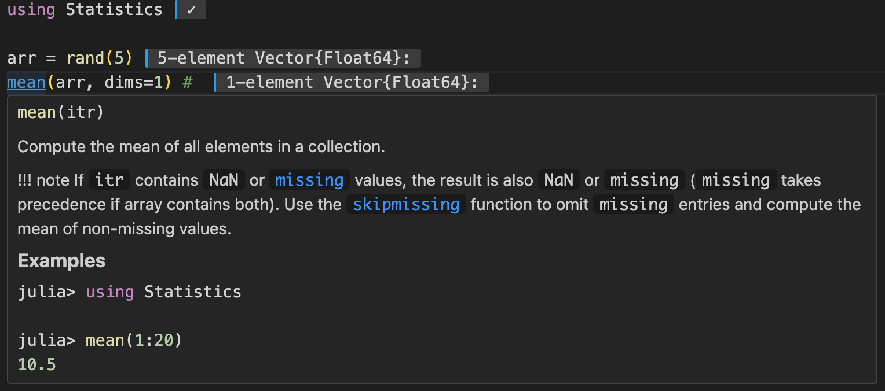
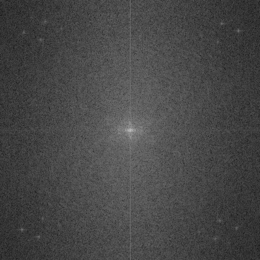
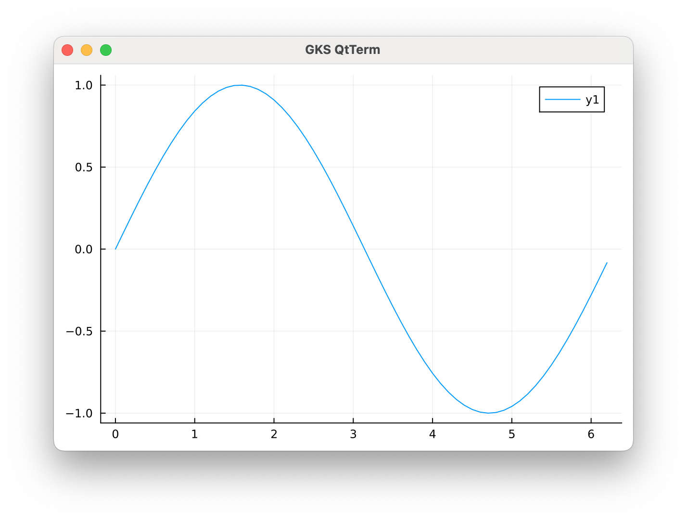
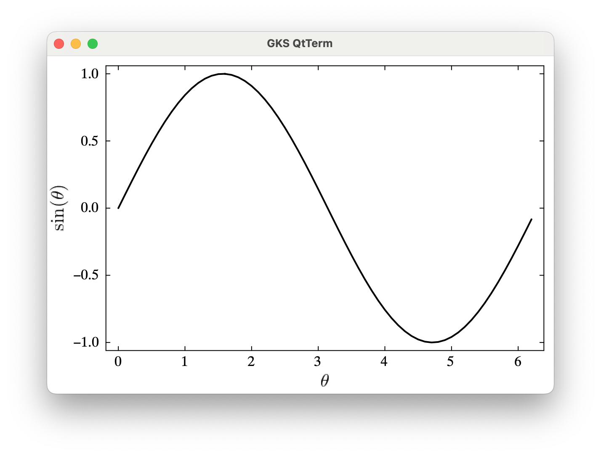
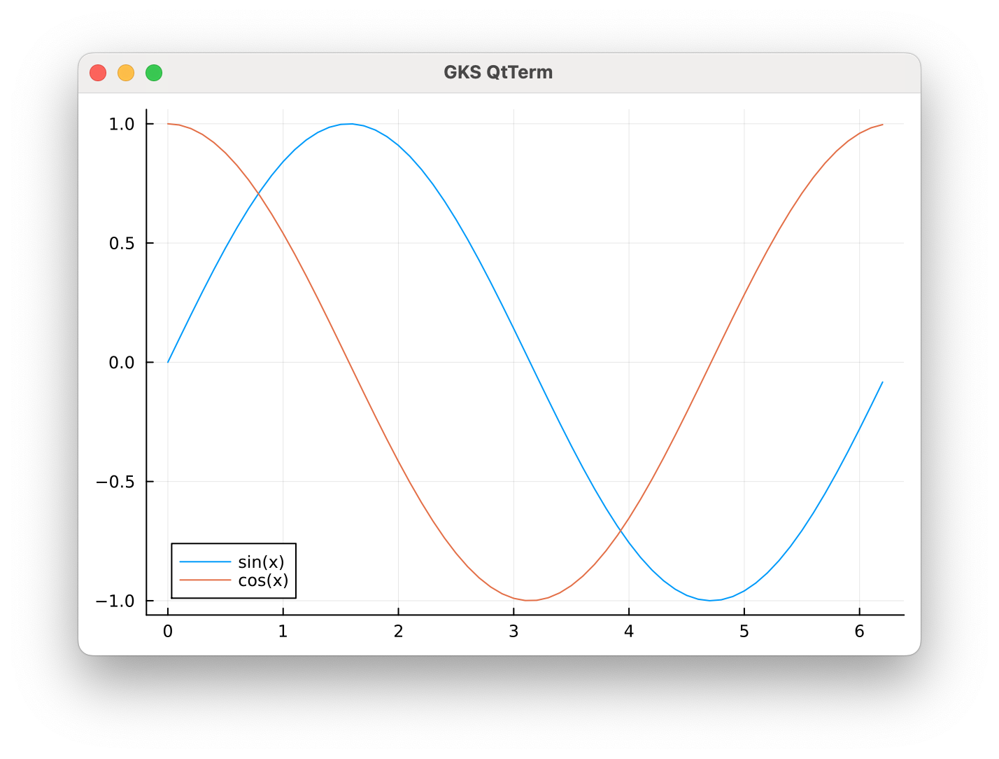
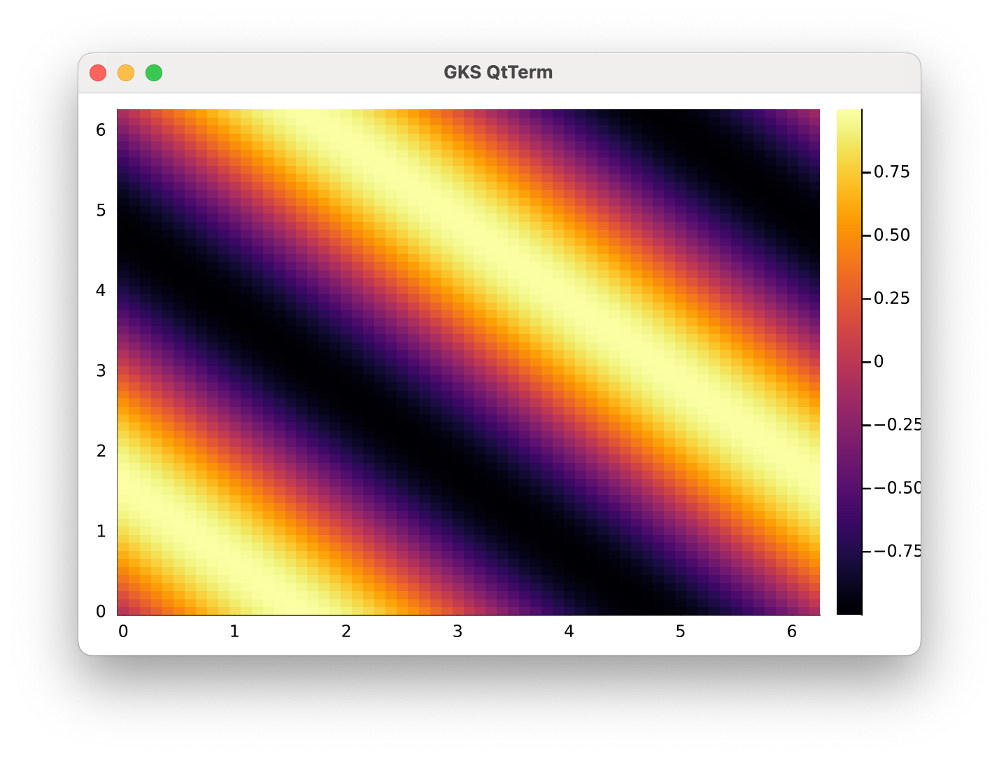
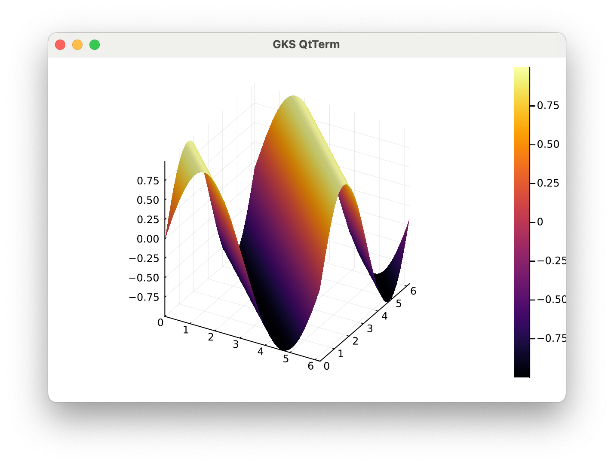
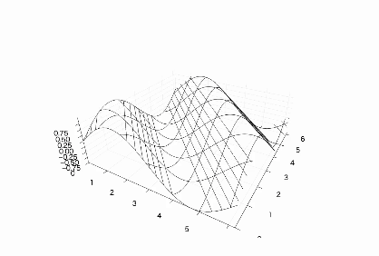
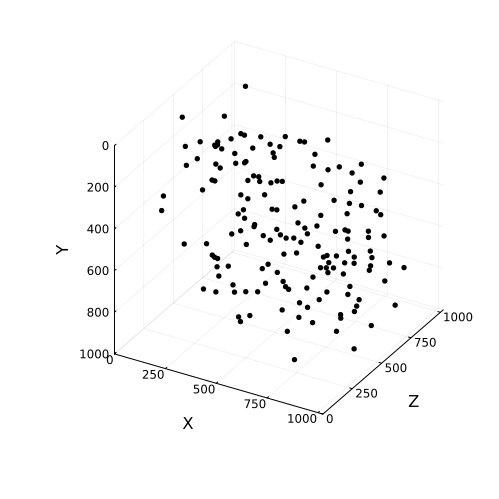
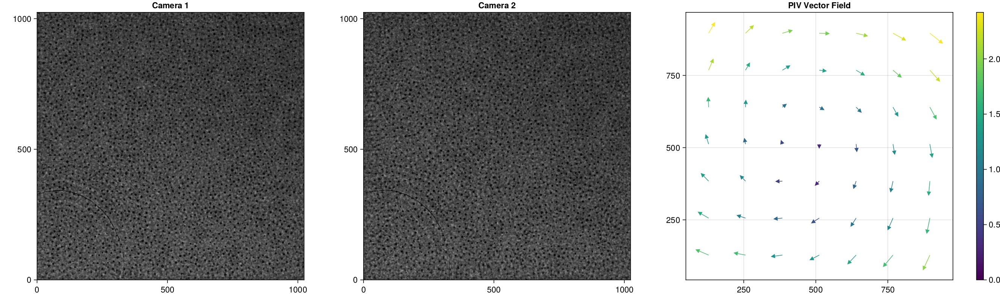

# はじめに
Julia言語は、2012年にMITのAlan Edelman氏らによって開発されたプログラミング言語です。C言語やFortranに匹敵する高速な実行速度を持ちながら、Pythonのような動的な型付けやインタラクティブな開発ができ、モダンな構文を備えています。Julia言語では最も基本的な機能以外のすべての機能はパッケージで提供されます。統計解析ではStatsBase.jl、機械学習ではFlux.jl、画像処理ではImages.jlなど、有志によってパッケージごとの開発が進められています。今回は、Julia言語の基本的な使い方と、代表的ないくつかのパッケージの使い方を紹介します。このドキュメントで紹介されているJulia言語やパッケージの機能は、C言語のプログラミング演習で必要になる事項と対応するよう選んでいます。機能の詳細はそれぞれのドキュメントを参照してください。Julia言語のすべてのパッケージはドキュメントの整備が義務付けられています。

- [はじめに](#はじめに)
  - [Installation](#installation)
  - [開発環境について](#開発環境について)
  - [Juliaコードの実行](#juliaコードの実行)
- [Basics](#basics)
  - [変数の型・配列](#変数の型配列)
  - [配列のスライス](#配列のスライス)
  - [ブロードキャスト](#ブロードキャスト)
  - [関数](#関数)
- [StatsBase.jl](#statsbasejl)
- [DelimitedFiles.jl](#delimitedfilesjl)
- [Images.jl](#imagesjl)
- [Plots.jl](#plotsjl)
  - [1次元プロット](#1次元プロット)
  - [2次元プロット](#2次元プロット)
  - [3次元プロット](#3次元プロット)
  - [その他の例](#その他の例)
- [Threads.jl, Distributed.jl](#threadsjl-distributedjl)
- [Spinnaker.jl](#spinnakerjl)
- [CUDA.jl](#cudajl)
  - [Array Programming](#array-programming)
  - [Kernel Programming](#kernel-programming)
- [ParticleHolography.jl](#particleholographyjl)
- [Tips](#tips)
  - [ProgressMeter.jl](#progressmeterjl)


## Installation
Windowsの方は
```powershell
C:\> winget install julia -s msstore
```
で、mac/linuxの方は
```bash
$ curl -fsSL https://install.julialang.org | sh
```
でJuliaをインストールしてください。上のコマンドでは、Juliaup というJuliaのバージョンマネージャがインストールされます。Juliaupの使い方は以下を参照してください。

https://note.com/mk_o/n/n3d3f75c1edca

基本的には、Juliaupをインストールすれば julia コマンドでJuliaを起動できます。バージョン10.2 のrelseaseが動くことを確認してください。

## 開発環境について
[Visual Studio Code](https://code.visualstudio.com/download) と [Julia拡張機能](https://marketplace.visualstudio.com/items?itemName=julialang.language-julia)、[学生ならGithub Copilotが無料](https://qiita.com/SNQ-2001/items/796dc5e794ac3f57a945)なのでぜひ使いましょう。Julia拡張機能では関数名やメソッドが補完され、以下のようにドキュメントの参照ができます。PythonのJupyter Notebookのような環境の[Pluto.jl](https://plutojl.org/)というのもありますが、私は使っていません。



## Juliaコードの実行
Juliaコードは、.jl という拡張子のファイルに書いて、julia コマンドで実行することができます。例えば、以下のようなコードを `hello.jl` というファイルに書いて、julia コマンドで実行することができます。

```julia
println("Hello, World!")
```

```bash
$ julia hello.jl
```

しかし、この方法は十分にテストされたコードを大規模に実行する場合などを除いてはあまり使われません。すべてのJuliaコードは１回目の実行時にはJITコンパイルが必要なため、高速に動作するのはあるランタイムの中で２回目以降の実行時です。小規模なコードを上記の方法で実行すると、この高速な動作の恩恵を受けられません。

Julia言語は、REPL (Read-Eval-Print Loop) という対話型のインタープリタを持っており、このREPLを使ってJuliaコードを対話的に実行することができます。REPLを起動するには、julia コマンドを引数なしで実行します。

```bash
$ julia
```

REPLを起動すると、以下のようなプロンプトが表示されます。

```
               _
   _       _ _(_)_     |  Documentation: https://docs.julialang.org
  (_)     | (_) (_)    |
   _ _   _| |_  __ _   |  Type "?" for help, "]?" for Pkg help.
  | | | | | | |/ _` |  |
  | | |_| | | | (_| |  |  Version 1.10.1 (2024-02-13)
 _/ |\__'_|_|_|\__'_|  |  Official https://julialang.org/ release
|__/                   |

julia>
```

このプロンプトにJuliaコードを入力すると、そのコードが実行されます。例えば、以下のように入力すると、`Hello, World!` と表示されます。

```julia
julia> println("Hello, World!")
Hello, World!

julia>
```

REPLを使ってJuliaコードを対話的に実行することで、コードの動作を確認したりコードの一部を変更しながら開発を進めることができます。その際に、JITコンパイルによる高速な動作の恩恵があります。以下は、二次元の浮動小数点配列の各要素の平方根を計算するコードを対話的に実行した例です。

```julia
julia> arr = rand(2^12, 2^12); # 式の最後にセミコロンを付けると出力が抑制されます。

julia> @time sqrt.(arr);
  0.066353 seconds (138.53 k allocations: 137.752 MiB, 3.35% gc time, 55.77% compilation time)

julia> @time sqrt.(arr);
  0.024167 seconds (3 allocations: 128.000 MiB, 13.29% gc time)
```

.jl ファイルに書いたコードを実行する場合は、REPLを起動してから `include` 関数を使ってファイルを読み込むことができます。テストが済んだコードは .jlファイルに書いて以下の方法で実行すると良いでしょう。

```julia
julia> include("hello.jl")
Hello, World!

julia>
```

REPLを終了するには、`Ctrl` + `D` を入力するか、`exit()` と入力します。

# Basics
## 変数の型・配列
Julia言語はPythonなどと同様動的型付け言語ですが、変数の型や関数の引数の型を明示的に指定することもできます。型を指定することでパフォーマンスが向上する場合もあります。型の詳細は[公式ドキュメント](https://mnru.github.io/julia-doc-ja-v1.0/manual/types.html)を参照してください。

```julia
julia> x = 1 # 整数で初期化するとデフォルトの整数型であるInt64になる
1

julia> typeof(x) # 変数の型を調べる
Int64

julia> y::Float64 = 2.0 # Float64型で初期化。C言語の double 型に相当。

julia> y
2.0
```

Juliaの古いバージョンではグローバルスコープで変数の型を明示的に指定することができないことに注意してください。関数の中ではできます。

Juliaの配列は添字のインデックスが１から始まります。一次元の配列はVector型、二次元の配列はMatrix型と呼ばれます。これらは次元の数を指定したArray型の別名(エイリアス)です。
    
```julia
julia> arr = [1, 2, 3] # 一次元の配列。縦ベクトルとして扱われる
3-element Vector{Int64}:
 1
 2
 3

julia> typeof(arr) == Array{Int64, 1}
true

julia> mat = [1 2 3; 4 5 6] # 二次元の配列
2×3 Matrix{Int64}:
 1  2  3
 4  5  6

julia> typeof(mat) == Array{Int64, 2}
true
```

それぞれの要素には以下のようにアクセスできます。

```julia
julia> arr[1]
1

julia> mat[1, 2]
2
```

２次元配列などの多次元配列は、一次元のインデックスによるアクセスもできますが、その場合はJuliaの多次元配列が列優先であることに注意してください。

```julia
julia> mat[2] # 2次元配列を1次元のインデックスでアクセス。2ではなく4が返る
4
```

つまり、for文で多次元配列を走査する場合は、C言語のように行優先で走査するよりも列優先で走査する方が効率が良いです。以下はそれぞれの走査方法による配列アクセスの実行時間を計測した例です。

```julia
julia> bigmat = rand(2^12, 2^12);

julia> @time for i in axes(bigmat, 1)
           for j in axes(bigmat, 2)
               bigmat[i, j]
           end
       end
  1.718725 seconds (62.94 M allocations: 1.188 GiB, 3.70% gc time, 0.35% compilation time)

julia> @time for j in axes(bigmat, 2)
           for i in axes(bigmat, 1)
               bigmat[i, j]
           end
       end
  0.786061 seconds (62.93 M allocations: 1.188 GiB, 8.22% gc time)
```

## 配列のスライス
配列の複数の要素をいっぺんに取り出したい場合はスライスが便利です。Pythonのスライスと同様に、`:` を使ってスライスを指定します。ただ、Pythonのようにスライスの端を省略できません。`end` というキーワードを使ってスライスの端を指定します。以下では一次元配列のスライスの例を示しますが、多次元配列に対しても各軸に対して同様にスライスを指定することができます。

```julia
julia> arr = [1, 2, 3, 4, 5]

julia> arr[2:4]
3-element Vector{Int64}:
 2
 3
 4

julia> arr[2:end-1]
3-element Vector{Int64}:
 2
 3
 4

julia> arr[1:2:end]
3-element Vector{Int64}:
 1
 3
 5
```

スライスで取り出した配列はもとの配列のコピーです。参照ではありません。なので取り出した配列の値を変更してももとの配列の値は変わりません。

```julia
julia> arr = [1, 2, 3, 4, 5]

julia> slice = arr[2:4]
3-element Vector{Int64}:
 2
 3
 4

julia> slice[1] = 100
100

julia> arr
5-element Vector{Int64}:
 1
 2
 3
 4
 5
```

取り出した配列をもとの配列の参照として扱う場合は、`@views` マクロを使います。

```julia
julia> @views viewslice = arr[2:4]
3-element view(::Vector{Int64}, 2:4) with eltype Int64:
 2
 3
 4

julia> viewslice[1] = 100
100

julia> arr
5-element Vector{Int64}:
   1
 100
   3
   4
   5
```

ビューを使うほうが効率はいいですが、コピーでも遅いということはないと思います。大規模な計算で性能を気にする場合はビューを使うと良いでしょう。

## ブロードキャスト
ブロードキャストはJuliaの真骨頂とも言える機能です。配列ではなく値を受け取る関数(たとえば`sqrt()`)があったとして、配列の各要素に対して順にこれを計算して入力配列と同じサイズの出力配列を得たい場合、C言語などではfor文で表現しますが、Juliaでは `.` 演算子を用いて以下のように完結に表現できます。

```julia
julia> arr = [1, 2, 3, 4, 5]

julia> sqrt.(arr)
5-element Vector{Float64}:
 1.0
 1.4142135623730951
 1.7320508075688772
 2.0
 2.23606797749979
```

`+`などの二項間演算子に対しても同様にブロードキャストができます。

```julia
julia> arr1 = [1, 2, 3, 4, 5]

julia> arr2 = [5, 4, 3, 2, 1]

julia> (arr1 .+ arr2).^2　# 要素ごとの和を計算してから要素ごとに二乗
5-element Vector{Int64}:
 36
 36
 36
 36
 36
```

積の計算では注意が必要です。たとえば行列に対して`.*` は要素ごとの積を計算しますが、`*` は行列積を計算します。この場合は構文エラーが出ないので注意してください。

```julia
julia> mat1 = [1 2; 3 4]

julia> mat2 = [5 6; 7 8]

julia> mat1 .* mat2 # 要素ごとの積。いわゆるアダマール積
2×2 Matrix{Int64}:
  5  12
 21  32

julia> mat1 * mat2 # 行列積
2×2 Matrix{Int64}:
 19  22
 43  50
```

## 関数
関数は以下のように定義します。関数の引数には型を指定することができますが、指定しなくても動的型付け言語なので型を指定しなくても動作します。関数の戻り値は最後の式の値です。`return` キーワードは省略できます。

```julia
function add(x::Int, y::Int)::Int
    return x + y
end
```

`return`キーワードがなくても関数の最後の式の評価値を返してしまうので、返り値がない関数を定義する場合は以下のように明示的に`return nothing`と書くと良いでしょう。

```julia
function add3_with_return!(vec::Vector{Int})
    x .= x .+ 3
end

function add3_void!(vec::Vector{Int})
    x .= x .+ 3
    return nothing
end
```

Juliaでは値は直接渡されますが配列は参照渡しです。そのため、関数の引数に配列を渡してその中身を変更することができます。返り値がなく、引数に渡した配列の中身を変更する、つまり破壊的操作を行う関数は、関数名の最後に`!`をつけるのが慣習です。

# StatsBase.jl
[StatsBase.jl](https://juliastats.org/StatsBase.jl/stable/) は統計解析のための基本的な関数を提供するパッケージです。以下は、StatsBase.jlの関数を使って平均値、中央値、分散、標準偏差を計算する例です。

```julia
using StatsBase

data = [1, 2, 3, 4, 5]

mean(data) # 平均値
median(data) # 中央値
var(data) # 分散
std(data) # 標準偏差
```

多次元配列に対して適用すると、すべての要素に対する統計量を計算します。では、多次元配列に対して特定の軸に沿った統計量を計算する場合を考えます。例えば、３次元の配列`vol`があって、`vol[x,y,z]`が`(x,y,z)`の位置の量を表すとき、各 $z$ に対して $x,y$ 平面の平均値を計算したい場合は以下のようにします。

```julia
using StatsBase

vol = rand(3,5,7)

mean(vol, dims=(1, 2)) # x,y平面の平均値
```

```
1×1×7 Array{Float64, 3}:
[:, :, 1] =
 0.4347427185642537

[:, :, 2] =
 0.43914306553148985

[:, :, 3] =
 0.48201124887447305

[:, :, 4] =
 0.4899449844330443

[:, :, 5] =
 0.6536652348876816

[:, :, 6] =
 0.5543984247719932

[:, :, 7] =
 0.4706389184500482
```

計算の結果は、`1×1×7`の３次元配列になります。`dims`にはタプルを渡すことで複数の軸に沿った統計量を計算することができます。ひとつの軸に沿った統計量を計算する場合は、`dims`に値を渡せば計算できます。上記の例の場合、わかりやすく`Vector`に変換するには以下のようにします。

```julia
mean(vol, dims=(1, 2))[1,1,:]
```
```julia
7-element Vector{Float64}:
 0.4347427185642537
 0.43914306553148985
 0.48201124887447305
 0.4899449844330443
 0.6536652348876816
 0.5543984247719932
 0.4706389184500482
```

他にも相関の計算やより高度な機能も提供されています。詳しくは[公式ドキュメント](https://juliastats.org/StatsBase.jl/stable/)を参照してください。

# DelimitedFiles.jl
[DelimitedFiles.jl](https://docs.julialang.org/en/v1/stdlib/DelimitedFiles/)はCSVファイルやテキストファイルなどのデリミタで区切られたファイルを読み書きするためのパッケージです。Juliaのプログラム間で使い回す計算結果を保存するために使えますし、[Gnuplot](http://www.gnuplot.info/)で可視化するためのテキストファイルを書き出すのにも使えます。以下は、Juliaで計算して得た配列をテキストファイルに書き出す例です。

```julia
using DelimitedFiles

# 配列はこのような使い方もできます
outputdata = []
for i in 1:10
    push!(outputdata, [i, i^2, i^3])
end

writedlm("output.txt", outputdata)
```

計算の結果得た`outputdata`は以下のような配列です。

```julia
10-element Vector{Any}:
 [1, 1, 1]
 [2, 4, 8]
 [3, 9, 27]
 [4, 16, 64]
 [5, 25, 125]
 [6, 36, 216]
 [7, 49, 343]
 [8, 64, 512]
 [9, 81, 729]
 [10, 100, 1000]
```

`outputdata = []`という初期化によって、`outputdata`は`Any`型の配列になります。`Any`型はどんな型の値（配列もArray型の値と考えることができます）も受け入れる型です。`outputdata`自体は１次元配列です。それぞれのベクトルの要素を取り出すには以下のようにします。

```julia
julia> outputdata[1]
3-element Vector{Int64}:
  1
  1
  1
```

`writedlm`関数は、第一引数にファイル名、第二引数に書き出すデータを取ります。デフォルトではデリミタ(区切り文字)はスペースです。出力ファイルは以下のようになります。

```
1	1	1
2	4	8
3	9	27
4	16	64
5	25	125
6	36	216
7	49	343
8	64	512
9	81	729
10	100	1000
```

書き出されたファイルは、要素が3つのベクトルのベクトルと、`10x3 Matrix`を区別できません。なので、これを読み込んだ配列は`10×3 Matrix{Float64}`型です。

```julia
julia> inputdata = readdlm("output.txt")
10×3 Matrix{Float64}:
  1.0    1.0    1.0
  2.0    4.0    8.0
  3.0    9.0   27.0
  4.0   16.0   64.0
  5.0   25.0  125.0
  6.0   36.0  216.0
  7.0   49.0  343.0
  8.0   64.0  512.0
  9.0   81.0  729.0
 10.0  100.0 1000.0
```

# Images.jl
[Images.jl](https://juliaimages.org/latest/)は画像処理のためのパッケージです。画像処理のための代表的なパッケージとして[OpenCV](https://opencv.org/)がありますが、Juliaでは[OpenCV.jl](https://juliaimages.org/OpenCV.jl/dev/)はあまり使われません。パッケージとして提供されてはいますが使えない機能も多いです。一方Images.jlはJuliaで最も活発に開発が行われているパッケージの一つでもあるので、やりたいことはいろいろなサブパッケージで提供されていることも多く、情報も豊富です。以下は、Images.jlを使って下の画像を配列として読み込む例です。


```julia
using Images

img = load("mandrill.png")
```

```julia
512×512 Array{RGB{N0f8},2} with eltype RGB{N0f8}:
 RGB{N0f8}(0.643,0.588,0.278)  RGB{N0f8}(0.247,0.224,0.122)  RGB{N0f8}(0.294,0.169,0.039)  RGB{N0f8}(0.373,0.369,0.18)   RGB{N0f8}(0.616,0.549,0.286)  …  RGB{N0f8}(0.275,0.278,0.216)  RGB{N0f8}(0.569,0.545,0.255)  RGB{N0f8}(0.459,0.467,0.267)  RGB{N0f8}(0.553,0.667,0.396)  RGB{N0f8}(0.702,0.737,0.463)
 RGB{N0f8}(0.471,0.49,0.243)   RGB{N0f8}(0.529,0.38,0.129)   RGB{N0f8}(0.216,0.137,0.09)   RGB{N0f8}(0.294,0.282,0.094)  RGB{N0f8}(0.455,0.337,0.18)      RGB{N0f8}(0.51,0.514,0.4)     RGB{N0f8}(0.478,0.498,0.349)  RGB{N0f8}(0.478,0.549,0.384)  RGB{N0f8}(0.533,0.624,0.502)  RGB{N0f8}(0.471,0.541,0.29)
 RGB{N0f8}(0.388,0.29,0.122)   RGB{N0f8}(0.518,0.463,0.18)   RGB{N0f8}(0.235,0.161,0.141)  RGB{N0f8}(0.212,0.18,0.114)   RGB{N0f8}(0.392,0.416,0.2)       RGB{N0f8}(0.467,0.506,0.416)  RGB{N0f8}(0.408,0.4,0.251)    RGB{N0f8}(0.463,0.365,0.353)  RGB{N0f8}(0.341,0.357,0.302)  RGB{N0f8}(0.376,0.314,0.192)
 RGB{N0f8}(0.251,0.31,0.188)   RGB{N0f8}(0.588,0.565,0.224)  RGB{N0f8}(0.443,0.384,0.137)  RGB{N0f8}(0.196,0.2,0.11)     RGB{N0f8}(0.318,0.349,0.212)     RGB{N0f8}(0.384,0.329,0.235)  RGB{N0f8}(0.42,0.482,0.22)    RGB{N0f8}(0.294,0.302,0.18)   RGB{N0f8}(0.357,0.282,0.2)    RGB{N0f8}(0.243,0.306,0.184)
 RGB{N0f8}(0.431,0.329,0.153)  RGB{N0f8}(0.51,0.518,0.18)    RGB{N0f8}(0.635,0.518,0.204)  RGB{N0f8}(0.235,0.18,0.165)   RGB{N0f8}(0.298,0.325,0.157)     RGB{N0f8}(0.306,0.404,0.318)  RGB{N0f8}(0.282,0.271,0.149)  RGB{N0f8}(0.239,0.231,0.224)  RGB{N0f8}(0.251,0.357,0.239)  RGB{N0f8}(0.314,0.369,0.235)
 RGB{N0f8}(0.38,0.329,0.114)   RGB{N0f8}(0.322,0.314,0.153)  RGB{N0f8}(0.702,0.651,0.271)  RGB{N0f8}(0.318,0.208,0.18)   RGB{N0f8}(0.29,0.302,0.165)   …  RGB{N0f8}(0.361,0.239,0.149)  RGB{N0f8}(0.227,0.212,0.153)  RGB{N0f8}(0.337,0.361,0.196)  RGB{N0f8}(0.545,0.675,0.325)  RGB{N0f8}(0.659,0.788,0.463)
 RGB{N0f8}(0.239,0.149,0.09)   RGB{N0f8}(0.275,0.184,0.102)  RGB{N0f8}(0.584,0.557,0.2)    RGB{N0f8}(0.624,0.514,0.184)  RGB{N0f8}(0.243,0.31,0.18)       RGB{N0f8}(0.38,0.192,0.118)   RGB{N0f8}(0.369,0.388,0.165)  RGB{N0f8}(0.714,0.804,0.353)  RGB{N0f8}(0.792,0.827,0.463)  RGB{N0f8}(0.651,0.675,0.467)
 RGB{N0f8}(0.212,0.09,0.122)   RGB{N0f8}(0.247,0.192,0.118)  RGB{N0f8}(0.451,0.482,0.161)  RGB{N0f8}(0.733,0.608,0.224)  RGB{N0f8}(0.373,0.345,0.235)     RGB{N0f8}(0.345,0.486,0.212)  RGB{N0f8}(0.663,0.702,0.376)  RGB{N0f8}(0.675,0.655,0.412)  RGB{N0f8}(0.42,0.537,0.271)   RGB{N0f8}(0.525,0.596,0.314)
 RGB{N0f8}(0.251,0.212,0.216)  RGB{N0f8}(0.263,0.161,0.145)  RGB{N0f8}(0.282,0.208,0.102)  RGB{N0f8}(0.525,0.475,0.196)  RGB{N0f8}(0.569,0.635,0.271)     RGB{N0f8}(0.478,0.373,0.22)   RGB{N0f8}(0.337,0.333,0.247)  RGB{N0f8}(0.545,0.561,0.314)  RGB{N0f8}(0.663,0.651,0.278)  RGB{N0f8}(0.467,0.518,0.29)
 RGB{N0f8}(0.216,0.125,0.09)   RGB{N0f8}(0.212,0.09,0.067)   RGB{N0f8}(0.2,0.208,0.063)    RGB{N0f8}(0.29,0.267,0.075)   RGB{N0f8}(0.616,0.62,0.2)        RGB{N0f8}(0.431,0.467,0.235)  RGB{N0f8}(0.345,0.322,0.176)  RGB{N0f8}(0.341,0.224,0.196)  RGB{N0f8}(0.38,0.318,0.153)   RGB{N0f8}(0.596,0.561,0.239)
 ⋮                                                                                                                                                     ⋱                                                                                            ⋮                             
 RGB{N0f8}(0.416,0.486,0.498)  RGB{N0f8}(0.447,0.525,0.529)  RGB{N0f8}(0.494,0.584,0.655)  RGB{N0f8}(0.463,0.58,0.675)   RGB{N0f8}(0.471,0.561,0.541)     RGB{N0f8}(0.42,0.369,0.263)   RGB{N0f8}(0.31,0.373,0.345)   RGB{N0f8}(0.318,0.361,0.302)  RGB{N0f8}(0.384,0.298,0.29)   RGB{N0f8}(0.267,0.365,0.345)
 RGB{N0f8}(0.459,0.51,0.463)   RGB{N0f8}(0.471,0.498,0.49)   RGB{N0f8}(0.447,0.557,0.569)  RGB{N0f8}(0.475,0.608,0.608)  RGB{N0f8}(0.537,0.588,0.584)     RGB{N0f8}(0.369,0.404,0.373)  RGB{N0f8}(0.337,0.349,0.298)  RGB{N0f8}(0.42,0.31,0.314)    RGB{N0f8}(0.298,0.318,0.224)  RGB{N0f8}(0.278,0.231,0.212)
 RGB{N0f8}(0.42,0.451,0.467)   RGB{N0f8}(0.416,0.498,0.475)  RGB{N0f8}(0.451,0.541,0.529)  RGB{N0f8}(0.486,0.561,0.557)  RGB{N0f8}(0.482,0.624,0.616)  …  RGB{N0f8}(0.443,0.447,0.416)  RGB{N0f8}(0.435,0.349,0.424)  RGB{N0f8}(0.345,0.376,0.345)  RGB{N0f8}(0.408,0.29,0.306)   RGB{N0f8}(0.329,0.337,0.365)
 RGB{N0f8}(0.38,0.42,0.447)    RGB{N0f8}(0.388,0.451,0.475)  RGB{N0f8}(0.451,0.541,0.561)  RGB{N0f8}(0.49,0.6,0.627)     RGB{N0f8}(0.525,0.604,0.596)     RGB{N0f8}(0.404,0.404,0.369)  RGB{N0f8}(0.306,0.392,0.369)  RGB{N0f8}(0.369,0.31,0.251)   RGB{N0f8}(0.373,0.31,0.29)    RGB{N0f8}(0.29,0.353,0.286)
 RGB{N0f8}(0.365,0.388,0.353)  RGB{N0f8}(0.361,0.486,0.478)  RGB{N0f8}(0.455,0.58,0.549)   RGB{N0f8}(0.553,0.62,0.596)   RGB{N0f8}(0.506,0.62,0.624)      RGB{N0f8}(0.369,0.443,0.392)  RGB{N0f8}(0.357,0.396,0.365)  RGB{N0f8}(0.373,0.373,0.278)  RGB{N0f8}(0.353,0.38,0.294)   RGB{N0f8}(0.349,0.325,0.333)
 RGB{N0f8}(0.376,0.451,0.525)  RGB{N0f8}(0.463,0.553,0.549)  RGB{N0f8}(0.522,0.627,0.62)   RGB{N0f8}(0.447,0.573,0.612)  RGB{N0f8}(0.471,0.584,0.565)     RGB{N0f8}(0.435,0.384,0.392)  RGB{N0f8}(0.341,0.333,0.388)  RGB{N0f8}(0.337,0.424,0.357)  RGB{N0f8}(0.42,0.318,0.349)   RGB{N0f8}(0.325,0.357,0.376)
 RGB{N0f8}(0.475,0.58,0.608)   RGB{N0f8}(0.482,0.612,0.588)  RGB{N0f8}(0.486,0.588,0.545)  RGB{N0f8}(0.49,0.612,0.592)   RGB{N0f8}(0.404,0.537,0.51)      RGB{N0f8}(0.369,0.337,0.333)  RGB{N0f8}(0.306,0.404,0.294)  RGB{N0f8}(0.431,0.286,0.235)  RGB{N0f8}(0.353,0.365,0.275)  RGB{N0f8}(0.318,0.314,0.235)
 RGB{N0f8}(0.494,0.663,0.659)  RGB{N0f8}(0.459,0.592,0.592)  RGB{N0f8}(0.475,0.533,0.522)  RGB{N0f8}(0.416,0.502,0.42)   RGB{N0f8}(0.396,0.396,0.451)  …  RGB{N0f8}(0.396,0.298,0.341)  RGB{N0f8}(0.325,0.314,0.337)  RGB{N0f8}(0.286,0.329,0.267)  RGB{N0f8}(0.388,0.271,0.337)  RGB{N0f8}(0.314,0.247,0.278)
 RGB{N0f8}(0.035,0.043,0.047)  RGB{N0f8}(0.039,0.047,0.043)  RGB{N0f8}(0.043,0.059,0.047)  RGB{N0f8}(0.047,0.063,0.043)  RGB{N0f8}(0.047,0.067,0.043)     RGB{N0f8}(0.012,0.02,0.024)   RGB{N0f8}(0.008,0.02,0.012)   RGB{N0f8}(0.02,0.031,0.02)    RGB{N0f8}(0.008,0.02,0.0)     RGB{N0f8}(0.016,0.02,0.008)
```

`img[1,1]`, すなわち座標原点は行列の左上、画像でも左上の点になります。行方向が $x$ 軸、配列の第２軸で、列方向が $y$ 軸、配列の第１軸になります。つまり、左上を原点として $x$ 軸は右方向、 $y$ 軸は下方向で、各点は`img[y,x]`で指定します。

この画像はもともとカラー画像なので、画像の各点は`RGB{N0f8}`型の値を持っています。`RGB{N0f8}`型は赤、緑、青の各成分を`N0f8`型で持つ型です。`N0f8`型は`FixedPointNumbers.Normed{UInt8, 8}`型のエイリアスで、`UInt8`型の値を`0.0`から`1.0`の範囲で表現する型です。つまり、この形式の輝度値は小数に見えますがこれは浮動小数ではなく固定小数で、`N0f8`型の0から1の値はそれぞれ`UInt8`型の0から255の値に一意に対応します。

研究で使う場合はほとんどグレースケール画像であること、固定小数ではなく浮動小数で扱ったほうが便利なことなどから、実際使う場合には以下のように変換しましょう。

```julia
img = Float32.(channelview(Gray.(img)))
```

`Gray.(img)`はカラー画像をグレースケール画像に変換します。`channelview`は画像の各チャンネルの輝度値を取り出す関数です。`Float32.`は配列の要素を`Float32`型に変換する関数です。これで、`img`は`512×512`の単精度浮動小数の配列になります。この操作の各ステップの出力を順に見ましょう。

`Gray.(img)`はカラー画像をグレースケール画像に変換します。グレースケールで保存されている画像は読み込んだ時点で`Gray`型の配列になっています。`Gray()`関数は`Gray`型の値を作成する関数です。`img`は配列なのでドット演算子によるブロードキャストで各要素に`Gray`型の値を作成します。

```julia
julia> Gray.(img)
512×512 Array{Gray{N0f8},2} with eltype Gray{N0f8}:
 Gray{N0f8}(0.569)  Gray{N0f8}(0.22)   Gray{N0f8}(0.192)  Gray{N0f8}(0.349)  Gray{N0f8}(0.537)  Gray{N0f8}(0.353)  Gray{N0f8}(0.243)  Gray{N0f8}(0.129)  …  Gray{N0f8}(0.639)  Gray{N0f8}(0.49)   Gray{N0f8}(0.302)  Gray{N0f8}(0.271)  Gray{N0f8}(0.518)  Gray{N0f8}(0.443)  Gray{N0f8}(0.6)    Gray{N0f8}(0.694)
 Gray{N0f8}(0.455)  Gray{N0f8}(0.396)  Gray{N0f8}(0.157)  Gray{N0f8}(0.263)  Gray{N0f8}(0.353)  Gray{N0f8}(0.212)  Gray{N0f8}(0.255)  Gray{N0f8}(0.18)      Gray{N0f8}(0.416)  Gray{N0f8}(0.286)  Gray{N0f8}(0.259)  Gray{N0f8}(0.498)  Gray{N0f8}(0.475)  Gray{N0f8}(0.51)   Gray{N0f8}(0.584)  Gray{N0f8}(0.49)
 Gray{N0f8}(0.302)  Gray{N0f8}(0.447)  Gray{N0f8}(0.18)   Gray{N0f8}(0.18)   Gray{N0f8}(0.384)  Gray{N0f8}(0.235)  Gray{N0f8}(0.235)  Gray{N0f8}(0.184)     Gray{N0f8}(0.322)  Gray{N0f8}(0.392)  Gray{N0f8}(0.533)  Gray{N0f8}(0.482)  Gray{N0f8}(0.384)  Gray{N0f8}(0.392)  Gray{N0f8}(0.345)  Gray{N0f8}(0.318)
 Gray{N0f8}(0.278)  Gray{N0f8}(0.533)  Gray{N0f8}(0.373)  Gray{N0f8}(0.188)  Gray{N0f8}(0.325)  Gray{N0f8}(0.471)  Gray{N0f8}(0.208)  Gray{N0f8}(0.184)     Gray{N0f8}(0.275)  Gray{N0f8}(0.475)  Gray{N0f8}(0.424)  Gray{N0f8}(0.333)  Gray{N0f8}(0.435)  Gray{N0f8}(0.286)  Gray{N0f8}(0.294)  Gray{N0f8}(0.275)
 Gray{N0f8}(0.341)  Gray{N0f8}(0.478)  Gray{N0f8}(0.518)  Gray{N0f8}(0.196)  Gray{N0f8}(0.298)  Gray{N0f8}(0.341)  Gray{N0f8}(0.29)   Gray{N0f8}(0.196)     Gray{N0f8}(0.373)  Gray{N0f8}(0.506)  Gray{N0f8}(0.424)  Gray{N0f8}(0.365)  Gray{N0f8}(0.259)  Gray{N0f8}(0.231)  Gray{N0f8}(0.314)  Gray{N0f8}(0.337)
 Gray{N0f8}(0.322)  Gray{N0f8}(0.298)  Gray{N0f8}(0.624)  Gray{N0f8}(0.239)  Gray{N0f8}(0.282)  Gray{N0f8}(0.376)  Gray{N0f8}(0.173)  Gray{N0f8}(0.18)   …  Gray{N0f8}(0.447)  Gray{N0f8}(0.553)  Gray{N0f8}(0.506)  Gray{N0f8}(0.267)  Gray{N0f8}(0.208)  Gray{N0f8}(0.333)  Gray{N0f8}(0.596)  Gray{N0f8}(0.714)
 Gray{N0f8}(0.169)  Gray{N0f8}(0.2)    Gray{N0f8}(0.525)  Gray{N0f8}(0.51)   Gray{N0f8}(0.275)  Gray{N0f8}(0.478)  Gray{N0f8}(0.208)  Gray{N0f8}(0.243)     Gray{N0f8}(0.545)  Gray{N0f8}(0.486)  Gray{N0f8}(0.22)   Gray{N0f8}(0.239)  Gray{N0f8}(0.357)  Gray{N0f8}(0.725)  Gray{N0f8}(0.776)  Gray{N0f8}(0.643)
 Gray{N0f8}(0.129)  Gray{N0f8}(0.2)    Gray{N0f8}(0.435)  Gray{N0f8}(0.6)    Gray{N0f8}(0.341)  Gray{N0f8}(0.467)  Gray{N0f8}(0.188)  Gray{N0f8}(0.231)     Gray{N0f8}(0.271)  Gray{N0f8}(0.224)  Gray{N0f8}(0.243)  Gray{N0f8}(0.412)  Gray{N0f8}(0.655)  Gray{N0f8}(0.631)  Gray{N0f8}(0.471)  Gray{N0f8}(0.541)
 Gray{N0f8}(0.224)  Gray{N0f8}(0.188)  Gray{N0f8}(0.22)   Gray{N0f8}(0.459)  Gray{N0f8}(0.573)  Gray{N0f8}(0.502)  Gray{N0f8}(0.231)  Gray{N0f8}(0.137)     Gray{N0f8}(0.376)  Gray{N0f8}(0.275)  Gray{N0f8}(0.31)   Gray{N0f8}(0.388)  Gray{N0f8}(0.325)  Gray{N0f8}(0.529)  Gray{N0f8}(0.612)  Gray{N0f8}(0.478)
 Gray{N0f8}(0.149)  Gray{N0f8}(0.125)  Gray{N0f8}(0.188)  Gray{N0f8}(0.251)  Gray{N0f8}(0.573)  Gray{N0f8}(0.31)   Gray{N0f8}(0.373)  Gray{N0f8}(0.231)     Gray{N0f8}(0.267)  Gray{N0f8}(0.365)  Gray{N0f8}(0.357)  Gray{N0f8}(0.431)  Gray{N0f8}(0.314)  Gray{N0f8}(0.255)  Gray{N0f8}(0.318)  Gray{N0f8}(0.533)
 ⋮                                                                                              ⋮                                                        ⋱                     ⋮                                                                                              ⋮                  
 Gray{N0f8}(0.467)  Gray{N0f8}(0.502)  Gray{N0f8}(0.565)  Gray{N0f8}(0.557)  Gray{N0f8}(0.533)  Gray{N0f8}(0.541)  Gray{N0f8}(0.557)  Gray{N0f8}(0.584)     Gray{N0f8}(0.388)  Gray{N0f8}(0.427)  Gray{N0f8}(0.376)  Gray{N0f8}(0.373)  Gray{N0f8}(0.349)  Gray{N0f8}(0.341)  Gray{N0f8}(0.322)  Gray{N0f8}(0.333)
 Gray{N0f8}(0.49)   Gray{N0f8}(0.49)   Gray{N0f8}(0.525)  Gray{N0f8}(0.569)  Gray{N0f8}(0.573)  Gray{N0f8}(0.584)  Gray{N0f8}(0.557)  Gray{N0f8}(0.596)     Gray{N0f8}(0.396)  Gray{N0f8}(0.412)  Gray{N0f8}(0.408)  Gray{N0f8}(0.388)  Gray{N0f8}(0.341)  Gray{N0f8}(0.341)  Gray{N0f8}(0.302)  Gray{N0f8}(0.243)
 Gray{N0f8}(0.443)  Gray{N0f8}(0.471)  Gray{N0f8}(0.514)  Gray{N0f8}(0.537)  Gray{N0f8}(0.58)   Gray{N0f8}(0.592)  Gray{N0f8}(0.537)  Gray{N0f8}(0.514)  …  Gray{N0f8}(0.4)    Gray{N0f8}(0.369)  Gray{N0f8}(0.404)  Gray{N0f8}(0.443)  Gray{N0f8}(0.384)  Gray{N0f8}(0.365)  Gray{N0f8}(0.325)  Gray{N0f8}(0.337)
 Gray{N0f8}(0.412)  Gray{N0f8}(0.435)  Gray{N0f8}(0.518)  Gray{N0f8}(0.569)  Gray{N0f8}(0.58)   Gray{N0f8}(0.506)  Gray{N0f8}(0.478)  Gray{N0f8}(0.494)     Gray{N0f8}(0.306)  Gray{N0f8}(0.373)  Gray{N0f8}(0.357)  Gray{N0f8}(0.4)    Gray{N0f8}(0.365)  Gray{N0f8}(0.322)  Gray{N0f8}(0.325)  Gray{N0f8}(0.325)
 Gray{N0f8}(0.376)  Gray{N0f8}(0.447)  Gray{N0f8}(0.541)  Gray{N0f8}(0.596)  Gray{N0f8}(0.584)  Gray{N0f8}(0.506)  Gray{N0f8}(0.459)  Gray{N0f8}(0.459)     Gray{N0f8}(0.325)  Gray{N0f8}(0.302)  Gray{N0f8}(0.408)  Gray{N0f8}(0.416)  Gray{N0f8}(0.38)   Gray{N0f8}(0.361)  Gray{N0f8}(0.361)  Gray{N0f8}(0.333)
 Gray{N0f8}(0.435)  Gray{N0f8}(0.525)  Gray{N0f8}(0.596)  Gray{N0f8}(0.541)  Gray{N0f8}(0.549)  Gray{N0f8}(0.498)  Gray{N0f8}(0.486)  Gray{N0f8}(0.518)     Gray{N0f8}(0.341)  Gray{N0f8}(0.337)  Gray{N0f8}(0.357)  Gray{N0f8}(0.4)    Gray{N0f8}(0.341)  Gray{N0f8}(0.388)  Gray{N0f8}(0.353)  Gray{N0f8}(0.349)
 Gray{N0f8}(0.553)  Gray{N0f8}(0.569)  Gray{N0f8}(0.553)  Gray{N0f8}(0.573)  Gray{N0f8}(0.494)  Gray{N0f8}(0.482)  Gray{N0f8}(0.502)  Gray{N0f8}(0.514)     Gray{N0f8}(0.29)   Gray{N0f8}(0.376)  Gray{N0f8}(0.361)  Gray{N0f8}(0.345)  Gray{N0f8}(0.361)  Gray{N0f8}(0.325)  Gray{N0f8}(0.349)  Gray{N0f8}(0.306)
 Gray{N0f8}(0.612)  Gray{N0f8}(0.553)  Gray{N0f8}(0.514)  Gray{N0f8}(0.467)  Gray{N0f8}(0.404)  Gray{N0f8}(0.467)  Gray{N0f8}(0.494)  Gray{N0f8}(0.502)  …  Gray{N0f8}(0.302)  Gray{N0f8}(0.294)  Gray{N0f8}(0.337)  Gray{N0f8}(0.333)  Gray{N0f8}(0.322)  Gray{N0f8}(0.31)   Gray{N0f8}(0.314)  Gray{N0f8}(0.271)
 Gray{N0f8}(0.043)  Gray{N0f8}(0.043)  Gray{N0f8}(0.051)  Gray{N0f8}(0.055)  Gray{N0f8}(0.059)  Gray{N0f8}(0.059)  Gray{N0f8}(0.071)  Gray{N0f8}(0.082)     Gray{N0f8}(0.016)  Gray{N0f8}(0.016)  Gray{N0f8}(0.02)   Gray{N0f8}(0.02)   Gray{N0f8}(0.016)  Gray{N0f8}(0.027)  Gray{N0f8}(0.016)  Gray{N0f8}(0.016)
```

`channelview`は画像の各チャンネルの輝度値を取り出す関数です。各要素は`Gray{N0f8}`型なので、出力は`512×512`の`Gray{N0f8}`型の配列になります。

```julia
julia> channelview(Gray.(img))
512×512 reinterpret(reshape, N0f8, ::Array{Gray{N0f8},2}) with eltype N0f8:
 0.569  0.22   0.192  0.349  0.537  0.353  0.243  0.129  0.278  0.302  0.361  0.569  0.6    0.424  0.29   0.573  0.718  0.471  0.314  0.365  0.286  0.353  …  0.678  0.639  0.71   0.753  0.718  0.294  0.541  0.69   0.365  0.255  0.38   0.294  0.231  0.392  0.639  0.49   0.302  0.271  0.518  0.443  0.6    0.694
 0.455  0.396  0.157  0.263  0.353  0.212  0.255  0.18   0.361  0.235  0.239  0.337  0.431  0.169  0.161  0.427  0.58   0.498  0.471  0.161  0.192  0.216     0.737  0.69   0.639  0.733  0.522  0.29   0.243  0.216  0.216  0.247  0.333  0.306  0.549  0.573  0.416  0.286  0.259  0.498  0.475  0.51   0.584  0.49
 0.302  0.447  0.18   0.18   0.384  0.235  0.235  0.184  0.424  0.412  0.192  0.227  0.282  0.149  0.118  0.204  0.459  0.412  0.388  0.227  0.282  0.208     0.678  0.722  0.588  0.686  0.404  0.361  0.176  0.208  0.325  0.282  0.259  0.502  0.588  0.376  0.322  0.392  0.533  0.482  0.384  0.392  0.345  0.318
 0.278  0.533  0.373  0.188  0.325  0.471  0.208  0.184  0.275  0.353  0.22   0.212  0.208  0.133  0.133  0.114  0.161  0.471  0.345  0.129  0.188  0.153     0.706  0.38   0.482  0.553  0.255  0.29   0.384  0.482  0.565  0.475  0.369  0.427  0.325  0.325  0.275  0.475  0.424  0.333  0.435  0.286  0.294  0.275
 0.341  0.478  0.518  0.196  0.298  0.341  0.29   0.196  0.22   0.463  0.475  0.188  0.337  0.29   0.114  0.082  0.22   0.392  0.6    0.188  0.145  0.22      0.231  0.224  0.522  0.376  0.373  0.604  0.612  0.631  0.659  0.545  0.482  0.345  0.361  0.267  0.373  0.506  0.424  0.365  0.259  0.231  0.314  0.337
 0.322  0.298  0.624  0.239  0.282  0.376  0.173  0.18   0.282  0.38   0.373  0.267  0.341  0.518  0.133  0.169  0.188  0.235  0.337  0.247  0.184  0.176  …  0.478  0.663  0.514  0.475  0.733  0.725  0.667  0.71   0.482  0.353  0.325  0.471  0.349  0.365  0.447  0.553  0.506  0.267  0.208  0.333  0.596  0.714
 0.169  0.2    0.525  0.51   0.275  0.478  0.208  0.243  0.255  0.427  0.357  0.263  0.38   0.463  0.282  0.247  0.216  0.4    0.298  0.259  0.298  0.204     0.761  0.569  0.651  0.796  0.749  0.753  0.682  0.514  0.325  0.439  0.498  0.365  0.592  0.573  0.545  0.486  0.22   0.239  0.357  0.725  0.776  0.643
 0.129  0.2    0.435  0.6    0.341  0.467  0.188  0.231  0.388  0.639  0.42   0.267  0.302  0.361  0.561  0.216  0.231  0.278  0.388  0.278  0.396  0.376     0.396  0.51   0.686  0.729  0.596  0.678  0.584  0.616  0.529  0.455  0.365  0.576  0.573  0.341  0.271  0.224  0.243  0.412  0.655  0.631  0.471  0.541
 0.224  0.188  0.22   0.459  0.573  0.502  0.231  0.137  0.255  0.514  0.686  0.275  0.451  0.361  0.635  0.416  0.278  0.329  0.498  0.337  0.439  0.357     0.663  0.525  0.588  0.576  0.604  0.776  0.804  0.71   0.396  0.282  0.314  0.486  0.58   0.62   0.376  0.275  0.31   0.388  0.325  0.529  0.612  0.478
 0.149  0.125  0.188  0.251  0.573  0.31   0.373  0.231  0.188  0.604  0.71   0.608  0.51   0.62   0.51   0.541  0.325  0.384  0.451  0.518  0.388  0.463     0.655  0.69   0.757  0.816  0.816  0.776  0.655  0.314  0.239  0.361  0.675  0.741  0.573  0.31   0.267  0.365  0.357  0.431  0.314  0.255  0.318  0.533
 ⋮                                  ⋮                                  ⋮                                  ⋮                                  ⋮             ⋱  ⋮                                  ⋮                                  ⋮                                  ⋮                                  ⋮      
 0.467  0.502  0.565  0.557  0.533  0.541  0.557  0.584  0.576  0.545  0.51   0.49   0.51   0.463  0.533  0.565  0.549  0.557  0.569  0.588  0.557  0.553     0.302  0.318  0.31   0.408  0.361  0.361  0.365  0.369  0.337  0.392  0.384  0.325  0.396  0.408  0.388  0.427  0.376  0.373  0.349  0.341  0.322  0.333
 0.49   0.49   0.525  0.569  0.573  0.584  0.557  0.596  0.565  0.557  0.541  0.49   0.463  0.478  0.518  0.557  0.557  0.588  0.576  0.553  0.529  0.529     0.286  0.322  0.325  0.361  0.404  0.376  0.435  0.365  0.337  0.38   0.376  0.329  0.38   0.408  0.396  0.412  0.408  0.388  0.341  0.341  0.302  0.243
 0.443  0.471  0.514  0.537  0.58   0.592  0.537  0.514  0.529  0.557  0.533  0.502  0.494  0.533  0.522  0.576  0.616  0.6    0.584  0.522  0.471  0.549  …  0.353  0.329  0.384  0.353  0.384  0.416  0.388  0.38   0.341  0.361  0.337  0.337  0.353  0.361  0.4    0.369  0.404  0.443  0.384  0.365  0.325  0.337
 0.412  0.435  0.518  0.569  0.58   0.506  0.478  0.494  0.51   0.525  0.522  0.494  0.525  0.541  0.569  0.569  0.62   0.616  0.549  0.482  0.514  0.549     0.341  0.357  0.314  0.353  0.333  0.369  0.396  0.388  0.345  0.369  0.322  0.243  0.353  0.329  0.306  0.373  0.357  0.4    0.365  0.322  0.325  0.325
 0.376  0.447  0.541  0.596  0.584  0.506  0.459  0.459  0.498  0.514  0.506  0.518  0.565  0.541  0.533  0.596  0.596  0.541  0.518  0.498  0.533  0.569     0.282  0.325  0.353  0.325  0.376  0.376  0.357  0.325  0.337  0.298  0.278  0.302  0.263  0.29   0.325  0.302  0.408  0.416  0.38   0.361  0.361  0.333
 0.435  0.525  0.596  0.541  0.549  0.498  0.486  0.518  0.522  0.49   0.498  0.561  0.518  0.588  0.612  0.576  0.584  0.549  0.557  0.553  0.588  0.569     0.325  0.31   0.373  0.31   0.325  0.365  0.325  0.345  0.333  0.302  0.306  0.298  0.314  0.224  0.341  0.337  0.357  0.4    0.341  0.388  0.353  0.349
 0.553  0.569  0.553  0.573  0.494  0.482  0.502  0.514  0.51   0.553  0.506  0.486  0.525  0.537  0.549  0.565  0.588  0.573  0.553  0.584  0.584  0.51      0.255  0.341  0.282  0.333  0.302  0.306  0.318  0.267  0.333  0.353  0.322  0.298  0.302  0.286  0.29   0.376  0.361  0.345  0.361  0.325  0.349  0.306
 0.612  0.553  0.514  0.467  0.404  0.467  0.494  0.502  0.549  0.565  0.498  0.514  0.463  0.514  0.537  0.573  0.557  0.549  0.533  0.522  0.51   0.51   …  0.278  0.306  0.361  0.278  0.259  0.255  0.298  0.314  0.322  0.302  0.282  0.314  0.282  0.251  0.302  0.294  0.337  0.333  0.322  0.31   0.314  0.271
 0.043  0.043  0.051  0.055  0.059  0.059  0.071  0.082  0.071  0.071  0.071  0.075  0.075  0.063  0.075  0.067  0.082  0.082  0.075  0.086  0.075  0.075     0.012  0.008  0.012  0.008  0.008  0.008  0.008  0.012  0.012  0.012  0.012  0.012  0.016  0.016  0.016  0.016  0.02   0.02   0.016  0.027  0.016  0.016
```

最後に、各要素を`Float32`型に変換して、`512×512`の`Matrix{Float32}`型の配列に変換します。

```julia
julia> Float32.(channelview(Gray.(img)))
512×512 Matrix{Float32}:
 0.568627   0.219608   0.192157   0.34902   0.537255   0.352941   0.243137   0.129412   0.278431   0.301961   0.360784   0.568627   0.6        0.423529   …  0.364706   0.254902   0.380392   0.294118   0.231373   0.392157   0.639216   0.490196   0.301961   0.270588   0.517647   0.443137  0.6        0.694118
 0.454902   0.396078   0.156863   0.262745  0.352941   0.211765   0.254902   0.180392   0.360784   0.235294   0.239216   0.337255   0.431373   0.168627      0.215686   0.247059   0.333333   0.305882   0.54902    0.572549   0.415686   0.286275   0.258824   0.498039   0.47451    0.509804  0.584314   0.490196
 0.301961   0.447059   0.180392   0.180392  0.384314   0.235294   0.235294   0.184314   0.423529   0.411765   0.192157   0.227451   0.282353   0.14902       0.32549    0.282353   0.258824   0.501961   0.588235   0.376471   0.321569   0.392157   0.533333   0.482353   0.384314   0.392157  0.345098   0.317647
 0.278431   0.533333   0.372549   0.188235  0.32549    0.470588   0.207843   0.184314   0.27451    0.352941   0.219608   0.211765   0.207843   0.133333      0.564706   0.47451    0.368627   0.427451   0.32549    0.32549    0.27451    0.47451    0.423529   0.333333   0.435294   0.286275  0.294118   0.27451
 0.341176   0.478431   0.517647   0.196078  0.298039   0.341176   0.290196   0.196078   0.219608   0.462745   0.47451    0.188235   0.337255   0.290196      0.658824   0.545098   0.482353   0.345098   0.360784   0.266667   0.372549   0.505882   0.423529   0.364706   0.258824   0.231373  0.313726   0.337255
 0.321569   0.298039   0.623529   0.239216  0.282353   0.376471   0.172549   0.180392   0.282353   0.380392   0.372549   0.266667   0.341176   0.517647   …  0.482353   0.352941   0.32549    0.470588   0.34902    0.364706   0.447059   0.552941   0.505882   0.266667   0.207843   0.333333  0.596078   0.713726
 0.168627   0.2        0.52549    0.509804  0.27451    0.478431   0.207843   0.243137   0.254902   0.427451   0.356863   0.262745   0.380392   0.462745      0.32549    0.439216   0.498039   0.364706   0.592157   0.572549   0.545098   0.486275   0.219608   0.239216   0.356863   0.72549   0.776471   0.643137
 0.129412   0.2        0.435294   0.6       0.341176   0.466667   0.188235   0.231373   0.388235   0.639216   0.419608   0.266667   0.301961   0.360784      0.529412   0.454902   0.364706   0.576471   0.572549   0.341176   0.270588   0.223529   0.243137   0.411765   0.654902   0.631373  0.470588   0.541176
 0.223529   0.188235   0.219608   0.458824  0.572549   0.501961   0.231373   0.137255   0.254902   0.513726   0.686275   0.27451    0.45098    0.360784      0.396078   0.282353   0.313726   0.486275   0.580392   0.619608   0.376471   0.27451    0.309804   0.388235   0.32549    0.529412  0.611765   0.478431
 0.14902    0.12549    0.188235   0.25098   0.572549   0.309804   0.372549   0.231373   0.188235   0.603922   0.709804   0.607843   0.509804   0.619608      0.239216   0.360784   0.67451    0.741176   0.572549   0.309804   0.266667   0.364706   0.356863   0.431373   0.313726   0.254902  0.317647   0.533333
 ⋮                                                     ⋮                                                      ⋮                                           ⋱                        ⋮                                                      ⋮                                                     ⋮          
 0.466667   0.501961   0.564706   0.556863  0.533333   0.541176   0.556863   0.584314   0.576471   0.545098   0.509804   0.490196   0.509804   0.462745      0.337255   0.392157   0.384314   0.32549    0.396078   0.407843   0.388235   0.427451   0.376471   0.372549   0.34902    0.341176  0.321569   0.333333
 0.490196   0.490196   0.52549    0.568627  0.572549   0.584314   0.556863   0.596078   0.564706   0.556863   0.541176   0.490196   0.462745   0.478431      0.337255   0.380392   0.376471   0.329412   0.380392   0.407843   0.396078   0.411765   0.407843   0.388235   0.341176   0.341176  0.301961   0.243137
 0.443137   0.470588   0.513726   0.537255  0.580392   0.592157   0.537255   0.513726   0.529412   0.556863   0.533333   0.501961   0.494118   0.533333   …  0.341176   0.360784   0.337255   0.337255   0.352941   0.360784   0.4        0.368627   0.403922   0.443137   0.384314   0.364706  0.32549    0.337255
 0.411765   0.435294   0.517647   0.568627  0.580392   0.505882   0.478431   0.494118   0.509804   0.52549    0.521569   0.494118   0.52549    0.541176      0.345098   0.368627   0.321569   0.243137   0.352941   0.329412   0.305882   0.372549   0.356863   0.4        0.364706   0.321569  0.32549    0.32549
 0.376471   0.447059   0.541176   0.596078  0.584314   0.505882   0.458824   0.458824   0.498039   0.513726   0.505882   0.517647   0.564706   0.541176      0.337255   0.298039   0.278431   0.301961   0.262745   0.290196   0.32549    0.301961   0.407843   0.415686   0.380392   0.360784  0.360784   0.333333
 0.435294   0.52549    0.596078   0.541176  0.54902    0.498039   0.486275   0.517647   0.521569   0.490196   0.498039   0.560784   0.517647   0.588235      0.333333   0.301961   0.305882   0.298039   0.313726   0.223529   0.341176   0.337255   0.356863   0.4        0.341176   0.388235  0.352941   0.34902
 0.552941   0.568627   0.552941   0.572549  0.494118   0.482353   0.501961   0.513726   0.509804   0.552941   0.505882   0.486275   0.52549    0.537255      0.333333   0.352941   0.321569   0.298039   0.301961   0.286275   0.290196   0.376471   0.360784   0.345098   0.360784   0.32549   0.34902    0.305882
 0.611765   0.552941   0.513726   0.466667  0.403922   0.466667   0.494118   0.501961   0.54902    0.564706   0.498039   0.513726   0.462745   0.513726   …  0.321569   0.301961   0.282353   0.313726   0.282353   0.25098    0.301961   0.294118   0.337255   0.333333   0.321569   0.309804  0.313726   0.270588
 0.0431373  0.0431373  0.0509804  0.054902  0.0588235  0.0588235  0.0705882  0.0823529  0.0705882  0.0705882  0.0705882  0.0745098  0.0745098  0.0627451     0.0117647  0.0117647  0.0117647  0.0117647  0.0156863  0.0156863  0.0156863  0.0156863  0.0196078  0.0196078  0.0156863  0.027451  0.0156863  0.0156863
```

たとえば[FFTW.jl](https://github.com/JuliaMath/FFTW.jl)でスペクトルを計算する場合、`fft()`は入力配列を浮動小数点の実数あるいは複素数型に変換します。そのため、画像配列は整数型（やその正規化である固定小数型）ではなく浮動小数点型で扱うのが良いでしょう。

```julia
using FFTW

img = Float32.(channelview(Gray.(img)))
img_fft = fftshift(fft(img))
```

```julia
512×512 Matrix{ComplexF32}:
 1.33247f5+0.0im      -3063.07+1114.47im   1863.21-817.962im    4359.8-345.421im  -5225.23-3261.41im  -237.672-1007.32im   1026.03-1054.68im  -799.776-227.048im  …  -799.776+227.048im   1026.03+1054.68im  -237.672+1007.32im  -5225.23+3261.41im    4359.8+345.421im   1863.21+817.962im  -3063.07-1114.47im
  -1345.93+816.98im    7178.03-1519.72im   285.879+1014.01im  -1644.17+325.324im   3240.55+4471.26im   959.861+1626.3im   -71.9872+535.165im   296.216-180.184im     -812.657-763.974im   -1759.1-140.366im  -2138.08+639.745im  -120.445+2055.87im   -5310.7+840.437im  -1859.29+2331.72im   3337.72+587.907im
  -1726.49+8321.53im  -2914.42-2375.57im  -658.569-2327.54im   2017.95+350.291im  -411.242-558.342im   -2274.2+601.579im   -675.63+1181.56im   989.397+967.138im      834.009+414.707im   874.909+72.1474im  -1470.78-144.277im   -439.38+1051.45im    2641.0+634.202im   834.563-3023.08im  -3819.58-2884.01im
   414.432+2695.97im  -1479.21-2541.61im   444.755+526.708im   409.631+1399.5im    712.769-618.226im   -70.807+906.656im  -562.296-565.327im     38.42-809.816im     -110.187+85.5695im  -102.856+248.695im   356.009-582.517im  -1583.03-1625.83im  -578.852+2004.67im   489.357+1049.95im   -2000.9-2083.43im
   719.427+683.618im  -565.347-745.451im   947.611-558.366im   228.876-138.52im   -399.153+853.18im    172.375+249.275im   258.593-127.282im   -181.55-441.438im      -796.12+183.372im  -153.223+516.796im    726.22+484.611im   240.411+103.843im   -340.56-250.166im  -45.7264-141.826im  -1621.91-477.825im
   154.189+902.476im   224.122-65.6009im    38.385-238.024im   221.823+497.277im   109.713+301.076im   24.8658-239.329im   18.5372-34.2183im   341.019+369.299im  …    80.213-275.241im  -351.609+374.081im   238.113-130.119im  -497.714-103.218im  -1003.21-219.528im  -508.693-516.247im  -520.985-153.251im
   545.418-610.485im   10.5939-264.178im  -1442.51-350.765im   189.403+630.962im   762.176-52.1603im  -571.543-303.102im  -125.261-95.1013im   73.8452+517.842im       485.31+371.847im  -402.528+450.992im   152.875-151.145im   398.691+55.4373im   -396.72+689.641im  -581.448+139.842im   251.972-545.407im
   947.885-13.1978im  -294.557-83.6294im  -347.905+179.489im   919.495+680.413im   245.706-477.968im   115.196-147.232im   327.418+36.3105im   361.563+116.47im       127.316-82.3113im   83.8176+552.1im     196.999-165.496im  -228.551-703.583im  -227.927+709.203im  -1127.92+147.119im  -600.068-77.5767im
   118.097-275.66im   -732.681-179.742im   272.171+132.646im   596.426+297.212im  -570.648-380.051im   260.896+102.263im  -144.993+391.567im   69.8672-245.77im       -574.21-185.135im   272.933+603.457im  -174.447-150.025im  -374.048-623.928im   30.2453+698.335im  -117.338+315.03im   -355.499-712.866im
  -142.808+17.8816im   -236.26-226.167im    294.34+653.417im   301.744+389.977im  -570.943-383.981im   1078.39-314.837im  -109.109+241.669im  -291.216-398.353im     -583.189-323.494im   170.848+132.152im   370.106-57.8134im  -230.343-111.422im   9.51019+252.698im   3.25945+670.35im   -426.947-770.024im
          ⋮                                                                                                   ⋮                                                   ⋱          ⋮                                                                                                   ⋮           
  -142.808-17.8816im  -426.947+770.025im   3.25946-670.35im    9.51019-252.698im  -230.343+111.422im   370.106+57.8134im   170.848-132.152im  -583.189+323.494im     -291.216+398.352im  -109.109-241.669im   1078.39+314.837im  -570.943+383.981im   301.744-389.977im    294.34-653.417im   -236.26+226.167im
   118.097+275.66im   -355.499+712.866im  -117.338-315.03im    30.2453-698.335im  -374.048+623.928im  -174.447+150.025im   272.933-603.457im   -574.21+185.135im      69.8672+245.77im   -144.993-391.567im   260.896-102.263im  -570.648+380.051im   596.426-297.212im   272.171-132.646im  -732.681+179.742im
   947.885+13.1978im  -600.068+77.5767im  -1127.92-147.119im  -227.927-709.203im  -228.551+703.583im   196.999+165.496im   83.8177-552.1im     127.316+82.3113im  …   361.563-116.47im    327.418-36.3105im   115.196+147.232im   245.706+477.968im   919.495-680.413im  -347.905-179.489im  -294.557+83.6294im
   545.418+610.485im   251.972+545.407im  -581.448-139.842im   -396.72-689.641im   398.691-55.4373im   152.875+151.145im  -402.528-450.992im    485.31-371.847im      73.8452-517.842im  -125.261+95.1013im  -571.543+303.102im   762.176+52.1603im   189.403-630.962im  -1442.51+350.765im   10.5939+264.178im
   154.189-902.476im  -520.985+153.251im  -508.693+516.247im  -1003.21+219.528im  -497.714+103.218im   238.113+130.119im  -351.609-374.081im    80.213+275.241im      341.019-369.299im   18.5372+34.2183im   24.8658+239.329im   109.713-301.075im   221.823-497.277im    38.385+238.024im   224.122+65.6009im
   719.427-683.618im  -1621.91+477.825im  -45.7264+141.826im   -340.56+250.166im   240.411-103.843im    726.22-484.611im  -153.223-516.796im   -796.12-183.372im      -181.55+441.438im   258.593+127.282im   172.375-249.275im  -399.153-853.18im    228.876+138.52im    947.611+558.366im  -565.347+745.451im
   414.432-2695.97im   -2000.9+2083.43im   489.357-1049.95im  -578.852-2004.67im  -1583.03+1625.83im   356.009+582.517im  -102.856-248.695im  -110.187-85.5694im        38.42+809.816im  -562.296+565.327im   -70.807-906.656im   712.769+618.226im   409.631-1399.5im    444.755-526.708im  -1479.21+2541.61im
  -1726.49-8321.53im  -3819.58+2884.01im   834.564+3023.08im    2641.0-634.202im  -439.381-1051.45im  -1470.78+144.277im   874.909-72.1474im   834.009-414.707im  …   989.397-967.138im   -675.63-1181.56im   -2274.2-601.579im  -411.242+558.342im   2017.95-350.291im  -658.569+2327.54im  -2914.42+2375.57im
  -1345.93-816.98im    3337.72-587.907im  -1859.29-2331.72im   -5310.7-840.437im  -120.445-2055.87im  -2138.08-639.745im   -1759.1+140.366im  -812.657+763.974im      296.216+180.184im  -71.9872-535.165im   959.861-1626.3im    3240.55-4471.26im  -1644.17-325.324im   285.879-1014.01im   7178.03+1519.72im
```

画像を保存する場合は、配列が実数型でその範囲が0以上1以下であることを確認してください。

```julia
img_fft = log.(abs.(img_fft) .+ 1)
img_fft = (img_fft .- minimum(img_fft)) ./ (maximum(img_fft) - minimum(img_fft))
save("img_fft.png", img_fft)
```



Juliaでは、グレースケールのBMP画像の保存ができません。1チャンネルの配列を保存しても、各チャンネルの値が等しいRGB画像として保存されます。この場合、保存容量が大きくなるため、例えば可逆圧縮のPNG形式で保存しています。

# Plots.jl
[Plots.jl](https://docs.juliaplots.org/stable/)は、Juliaで最もよく用いられている可視化パッケージです。例を見ましょう。

## 1次元プロット
```julia
using Plots

x = 0:0.1:2π
y = sin.(x)
plot(x, y)
```



$x$ 軸、 $y$ 軸にLaTeXの数式フォントを使うこともできます。Gnuplotライクなスタイルを使うこともできます。が、私は論文ではこれではなくGnuplotを使っています。

```julia
using LaTeXStrings
plot(x, y, xlabel=L"\theta", ylabel=L"\sin(\theta)", legend=false, grid=false, framestyle=:box, fontfamily="Times", tickfontsize=10, labelfontsize=15, color=:black, linewidth=2)
```



保存する場合は、`savefig()`を使います。PDF形式でもPNG形式でも保存できます。

```julia
savefig("plot.pdf")
```

`plot()`関数では常に新たなプロットが作成されます。それに対して、`plot!()`関数は既存のプロットに追加します。

```julia
plot(x, y, label="sin(x)")
plot!(x, cos.(x), label="cos(x)")
```



## 2次元プロット
2次元プロットは、`heatmap()`関数を使います。

```julia
x = 0:0.1:2π
y = 0:0.1:2π
z = [sin(i + j) for i in x, j in y]
heatmap(x, y, z)
```



## 3次元プロット
3次元プロットは、`surface()`関数を使います。

```julia
x = 0:0.1:2π
y = 0:0.1:2π
z = [sin(i + j) for i in x, j in y]
surface(x, y, z)
```



`wireframe()`関数を使うと、ワイヤーフレームプロットができます。さらに、Plotsはバックエンドを選択でき、たとえば`plotly()`関数を使うと、ブラウザでインタラクティブなプロットができます。

```julia
plotly()
wireframe(x, y, z)
```



## その他の例
連続のプロットによるアニメーションはJuliaから直接作成・保存できます。[Animation](https://docs.juliaplots.org/latest/animations/)を参照してください。


Plots.jlとは別のパッケージである[Makie.jl](https://docs.makie.org/v0.21/)ではもっとファンシーなプロットも作成できます。私はなんとなくバンドル調整の可視化で使いました。



# Threads.jl, Distributed.jl
[Threads.jl](https://docs.julialang.org/en/v1/manual/multi-threading/), [Distributed.jl](https://github.com/JuliaLang/Distributed.jl?tab=readme-ov-file)はスレッド並列やプロセス並列、マルチノードでの計算を行うための標準ライブラリです。JuliaではC言語などのように一文pragmaを加えるだけで簡単にスレッド並列できる、というわけではありませんが、決して難しくはありません。スレッド並列はPythonは苦手なのでアドバンテージがあります。また、Pythonでは簡単なプロセス並列はC言語ではすこし面倒ですがJuliaでは非常に簡単です。Juliaではこういった並列処理が非常に簡単にできるので、大規模な計算を行う場合には非常に有用です。この記事では、Distributed.jlによるシングルノードのプロセス並列について簡単に書きます。

配列の各成分を読み込んでその２乗を計算し`println()`で表示するプロセス並列処理を考えます。

```julia
using Distributed

addprocs(4)
@everywhere function f(x)
    println("Input: ", x, " Output: ", x^2)
end

x = 1:4
pmap(f, x)
```

```julia
      From worker 2:    Input: 2 Output: 4
      From worker 3:    Input: 4 Output: 16
      From worker 5:    Input: 1 Output: 1
      From worker 4:    Input: 3 Output: 9
4-element Vector{Nothing}:
 nothing
 nothing
 nothing
 nothing
```

`addprocs(4)`で4つのワーカープロセスを追加し、`@everywhere`で関数`f()`を全てのプロセスに送信します。`pmap()`関数は`map()`関数と同じですが、プロセス並列で処理を行います。このとき、メインプロセスは処理を行わないので`f()`の計算を行うプロセス数は4です。この処理は非常に簡単ですが、たとえば`x`が時系列画像データのパスの配列で、それぞれを処理して結果を保存する場合などに便利です。


# Spinnaker.jl
[Spinnaker.jl](https://github.com/samuelpowell/Spinnaker.jl)はFLIRカメラを制御するためのパッケージです。使用時にはSpinaker SDKのインストールが必要です。また、[C++のドキュメント](https://softwareservices.flir.com/Spinnaker/latest/_programmer_guide.html)を先に読みましょう。Juliaラッパーに関してはパッケージのドキュメントが十分丁寧かつ詳細に書いていますので説明は省略します。

# CUDA.jl
[CUDA.jl](https://cuda.juliagpu.org/stable/)はJuliaでNVIDIA GPUを使って並列計算をするためのパッケージです。この記事では、CUDA.jlを使ってカーネルプログラミングをするために必要なことのみを簡単に説明しますが、[CUDAのプログラミングモデル](https://download.nvidia.com/developer/cuda/jp/CUDA_Programming_Model_jp.pdf)などで簡単に学習することをおすすめします。

## Array Programming
はじめに、カーネルを定義せずにGPUで配列計算をしてみます。`CUDA.jl`パッケージでは、抽象化された型の引数を取れる関数とブロードキャストによってカーネルを定義しなくても、GPUで計算を行うことができます。

```julia
using CUDA

a = CUDA.fill(1.0f0, 10)
b = CUDA.fill(2.0f0, 10)
c = a .+ b
```

```julia
10-element CuArray{Float32, 1}:
3.0
3.0
3.0
3.0
3.0
3.0
3.0
3.0
3.0
3.0
```

これも例によって一度目の実行はコンパイルが必要なので多少時間がかかりますが、２回目以降は高速に計算できます。高速な計算をするためのコツは、繰り返される計算ごとに変数の型が変わらないようにすることです。

ホスト（CPU）、デバイス（GPU）間のデータ転送は以下のように行います。

```julia
a = rand(10) # CPU上の配列
d_a = cu(a) # GPU上の配列
b = Array(d_a) # CPU上の配列
a == b # true
```

CUDA.jlではユニファイドメモリは実装されていません。そのため、データの転送は明示的に行う必要があります。

実は、Gerchberg-Saxtonアルゴリズムはカーネルの定義なしで実装できます。

```julia
"""
    cu_phase_retrieval_holo(holo1, holo2, transfer, invtransfer, priter, datlen)

Perform the Gerchberg-Saxton algorithm-based phase retrieving on two holograms and return the retrieved wavefront at the z-coordinate point of `holo1`. The algorithm is repeated `priter` times. `holo1` and `holo2` are the holograms (I = |phi|^2) of the object at two different z-coordinates. `transfer` and `invtransfer` are the transfer functions for the propagation from `holo1` to `holo2` and vice versa. `datlen` is the size of the holograms.

# Arguments
- `holo1::CuArray{Float32,2}`: The hologram at the z-cordinate of closer to the object.
- `holo2::CuArray{Float32,2}`: The hologram at the z-coordinate of further from the object.
- `transfer::CuTransfer{ComplexF32}`: The transfer function from `holo1` to `holo2`.
- `invtransfer::CuTransfer{ComplexF32}`: The transfer function from `holo2` to `holo1`.
- `priter::Int`: The number of iterations to perform the algorithm.
- `datlen::Int`: The size of the holograms.

# Returns
- `CuWavefront{ComplexF32}`: The retrieved wavefront at the z-coordinate of `holo1`. See [`CuWavefront`](@ref).
"""
function cu_phase_retrieval_holo(holo1::CuArray{Float32,2}, holo2::CuArray{Float32,2}, transfer::CuTransfer{ComplexF32}, invtransfer::CuTransfer{ComplexF32}, priter::Int, datlen::Int)
    @assert size(holo1) == size(holo2) == size(transfer.data) == size(invtransfer.data) == (datlen, datlen) "All arrays must have the same size as ($datlen, $datlen). Got $(size(holo1)), $(size(holo2)), $(size(transfer.data)), $(size(invtransfer.data))."

    light1 = CuArray{ComplexF32}(undef, datlen, datlen)
    light2 = CuArray{ComplexF32}(undef, datlen, datlen)
    phi1 = CuArray{Float32}(undef, datlen, datlen)
    phi2 = CuArray{Float32}(undef, datlen, datlen)
    sqrtI1 = sqrt.(holo1)
    sqrtI2 = sqrt.(holo2)

    light1 .= sqrtI1 .+ 0.0im

    for _ in 1:priter
        # STEP1
        light2 .= CUFFT.ifft(CUFFT.ifftshift(CUFFT.fftshift(CUFFT.fft(light1)).*transfer.data))
        phi2 .= angle.(light2)

        # STEP2
        light2 .= sqrtI2.*exp.(1.0im.*phi2)

        # STEP3
        light1 .= CUFFT.ifft(CUFFT.ifftshift(CUFFT.fftshift(CUFFT.fft(light2)).*invtransfer.data))
        phi1 .= angle.(light1)

        # STEP4
        light1 .= sqrtI1.*exp.(1.0im.*phi1)
    end

    return CuWavefront(light1)
end
```

## Kernel Programming
カーネルとは、GPU上で並列計算を行うための関数です。CUDA C/C++では、`__global__`修飾子などを使ってカーネルを定義しましたが、CUDA.jlでは普通の関数と同じように定義します。ただし、実行時には`@cuda`マクロを使ってGPU上で実行することを指定します。

```julia
function kernel_vadd(a, b, c)
    i = threadIdx().x
    c[i] = a[i] + b[i]
    return
end

a = rand(10)
b = rand(10)
c = similar(a)
@cuda threads=10 kernel_vadd(a, b, c)
```

# ParticleHolography.jl

# Tips
## ProgressMeter.jl
[ProgressMeter.jl](https://github.com/timholy/ProgressMeter.jl)は進捗バーを表示するためのパッケージです。`@showprogress`マクロを使います。残り時間がわかるので便利です。

```julia
using ProgressMeter

@showprogress for i in 1:100
    sleep(0.1)
end
```

```julia
Progress: 100%|█████████████████████████████████████████| Time: 0:00:11
```